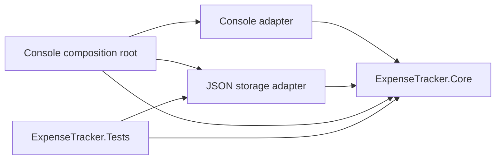

# Architecture Spine — Console Expense Tracker

## Design Paradigm

Ports and adapters. `ExpenseTracker.Core` owns policy, use cases, state, and port contracts. `ExpenseTracker.ConsoleApp` owns the console input/output and JSON filesystem adapters plus composition. Dependencies point inward.



## Invariants & Rules

### AD-1 — Inward dependency

- **Binds:** CAP-1 through CAP-5
- **Prevents:** Console and filesystem concerns becoming domain policy or making the core depend on an adapter.
- **Rule:** `ExpenseTracker.Core` references no project in this solution and performs no console or filesystem I/O; adapters may depend on the core.

### AD-2 — Three-project boundary

- **Binds:** all
- **Prevents:** Both a monolithic project with invisible boundaries and project-per-concept ceremony.
- **Rule:** Production code is split between `ExpenseTracker.Core` and `ExpenseTracker.ConsoleApp`; all automated tests live in `ExpenseTracker.Tests`; the JSON adapter remains in the console host project.

### AD-3 — Single state owner

- **Binds:** CAP-1 through CAP-5
- **Prevents:** Commands maintaining competing collections or a failed load partially replacing live data.
- **Rule:** One core `ExpenseTracker` service exclusively owns the in-memory expense collection. All mutation passes through it. Load validates a complete candidate collection before replacing current state atomically.

### AD-4 — Explicit recoverable input failures

- **Binds:** CAP-1 through CAP-5
- **Prevents:** Invalid commands, fields, paths, or storage failures being handled inconsistently or terminating the command loop.
- **Rule:** Every user-originated parse, validation, and storage failure becomes one explicit operation result categorized as `InvalidCommand`, `InvalidInput`, `StorageUnavailable`, or `StorageDataInvalid`. The console owns final display wording, renders the failure once, and reads the next command; console EOF is the only normal loop exit. Exceptions represent unexpected programming faults only.

### AD-5 — Tests follow boundaries

- **Binds:** CAP-1 through CAP-5
- **Prevents:** Core tests depending on interactive console input or the real filesystem and adapter behavior remaining unverified.
- **Rule:** Core behavior is tested directly in memory. JSON adapter tests use isolated temporary files. End-to-end console automation is outside V1.

### AD-6 — Persistence DTO boundary

- **Binds:** CAP-5
- **Prevents:** Serialized data bypassing domain validation or forcing the domain model to match a file schema.
- **Rule:** JSON DTOs belong to the storage adapter. The root is a non-null array of non-null items containing required `amount`, `category`, and `date` properties plus optional `description`; unknown properties are ignored. The adapter maps DTOs to core-owned unvalidated expense inputs, and the core load use case maps every input through the same creation validation used by `add`; only a wholly valid, materialized collection may be committed.

### AD-7 — Core-owned persistence protocol

- **Binds:** CAP-5
- **Prevents:** Storage adapters orchestrating state mutation or querying a concrete state owner through incompatible APIs.
- **Rule:** Core use cases orchestrate save and load through a core-owned synchronous storage port. Save passes one detached immutable expense snapshot to the port. Load receives a complete sequence of core-owned unvalidated expense inputs from the port, validates and materializes it, then commits through AD-3; the adapter never validates domain rules or receives the state owner.

### AD-8 — Immutable values and deterministic local date

- **Binds:** CAP-1, CAP-2, CAP-5
- **Prevents:** Mutation outside the state owner, live-view snapshots, and nondeterministic omitted-date behavior.
- **Rule:** `Expense` is immutable, uses `DateOnly`, and is created only through core validation. Queries return detached point-in-time sequences. The core applies an omitted date through a core-owned local-date provider port; production supplies system local date and tests supply a fixed date. A stored expense must always contain a date and never receives a default during load.

## Consistency Conventions

| Concern | Convention |
| --- | --- |
| Namespaces | Match project and responsibility: `ExpenseTracker.Core`, `.Core.Ports`, `.ConsoleApp.Console`, `.ConsoleApp.Storage`. |
| Ports | Core-owned interfaces describe required capability and do not expose console, file, or JSON types. |
| State | Expose detached point-in-time snapshots of immutable expenses; only the core `ExpenseTracker` service mutates its private collection. |
| Expected errors | Return one operation-result shape using the four AD-4 categories; technical context stays internal and the console maps categories to display text. |
| JSON | UTF-8 JSON array; camel-case properties; indented output; invariant decimal numbers; dates formatted `yyyy-MM-dd`. |
| Console parsing | Command names use ordinal case-insensitive matching; amounts use invariant culture; interactive dates use `yyyy-MM-dd`. |
| Text normalization | Trim category and description; reject blank category; normalize blank description to null. |
| Category comparison | Use `StringComparer.OrdinalIgnoreCase` for identity and ordering; preserve the first canonical spelling for display. |
| Ordering | Expenses by date then sequence position; JSON array order preserves sequence position across save/load. |

## Stack

| Name | Version / source |
| --- | --- |
| .NET SDK / target framework | 10.0.401 / net10.0 |
| C# | 14 |
| System.Text.Json | In-box with `Microsoft.NETCore.App` for net10.0 |
| xUnit.net v3 package | `xunit.v3` 4.0.1 |

## Structural Seed

```text
BmadTutorial.slnx
global.json              # SDK 10.0.401, rollForward latestPatch
src/
  ExpenseTracker.Core/
    Models/          # Expense and validated value creation
    Ports/           # Core-owned persistence contract
    Services/        # State owner and capability operations
    Results/         # Expected operation outcomes
  ExpenseTracker.ConsoleApp/
    Console/         # Command parsing and rendering adapter
    Storage/         # JSON DTOs, mapping, and filesystem adapter
    Program.cs       # Composition root and command loop
tests/
  ExpenseTracker.Tests/
    Core/
    Storage/
```

The runtime is one local console process. Its only external resource is a user-selected file on the local filesystem; V1 has no server, provider, deployment environment, network, background worker, telemetry, or concurrent writer.

## Capability → Architecture Map

| Capability / Area | Lives in | Governed by |
| --- | --- | --- |
| CAP-1 add | Core model and state owner; console input adapter | AD-1, AD-3, AD-4 |
| CAP-2 list | Core read-only snapshot; console renderer | AD-1, AD-3 |
| CAP-3 total | Core service | AD-1, AD-3 |
| CAP-4 categories | Core service; console renderer | AD-1, AD-3 |
| CAP-5 storage | Core port and atomic replacement; JSON adapter | AD-1, AD-3, AD-4, AD-6, AD-7, AD-8 |
| Automated verification | Test project | AD-5 |

## Deferred

- Exact console prompts, colors, and table formatting are local adapter choices because the command contract fixes behavior.
- Exact type and method names below the named projects and responsibilities are owned by implementation.
- JSON schema versioning and migration wait until a requirement to read an older schema exists.
- Logging and telemetry wait until the local learning application has an operational consumer.
- Packaging and deployment wait until distribution beyond `dotnet run` is requested.

## Verified Baseline

- .NET 10 SDK `10.0.401`, target `net10.0`, and C# 14 verified 2026-09-20 against Microsoft .NET download, template, and language-version documentation.
- xUnit.net v3 `4.0.1` verified 2026-09-20 against xUnit release documentation. Scaffold with the `xunit.v3.templates` 4.0.1 package and its `xunit3` template; do not use the SDK's ambiguous `xunit` template.
